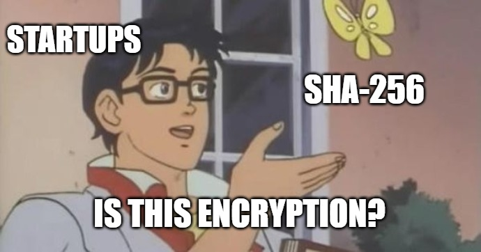

# Hash-Crypt

[](https://travis-ci.org/soatok/hash-crypt)
[](https://packagist.org/packages/soatok/hash-crypt)

> **Warning!** This is an experimental design. Don't ever use this in production.
> It was created to demonstrate a concept for educational purposes. Just use libsodium.

A proof-of-concept for turning any arbitrary hash function into an AEAD cipher.

Usage:

```php
<?php
declare(strict_types=1);

use ParagonIE\ConstantTime\Binary;
use Soatok\HashCrypt\{
    HashCrypt,
    Key
};

$key = Key::generate();
$hashCrypt = new HashCrypt('sha256', $key);

$message = 'This is a secret message';
$encrypted = $hashCrypt->encrypt($message);
$decrypted = $hashCrypt->decrypt($encrypted);
var_dump($encrypted === $decrypted); // bool(true)

### Messages can also have additional authenticated data attached to the ciphertext.
### This is used to calculate tha authentication tag, but is not included in the
### ciphertext message itself.

$ciphertext2 = $hashCrypt->encrypt($message, 'additional authenticated data');
var_dump(Binary::safeStrlen($encrypted) === Binary::safeStrlen($ciphertext2)); // bool(true)

try {
    $decrypted = $hashCrypt->decrypt($ciphertext2);
} catch (\Soatok\HashCrypt\CryptoException $ex) {
    // Invalid message authentication code.
    echo $ex->getMessage();
    exit(1);
}
```

# Frequently Asked Questions

## 

SHA-256 isn't encryption. SHA-256 is a hash function.

I did build an AEAD cipher *out of* SHA-256.

## Should I use this?

No.

## Are you insane?!

Well, I am [a furry](https://soatok.com)...
